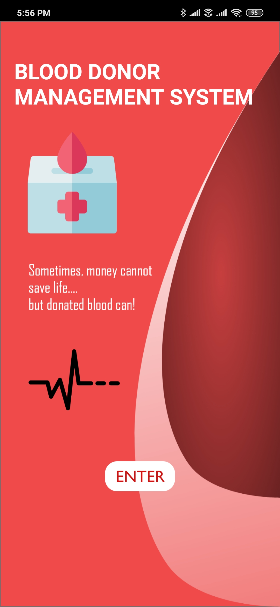

# Blood Point
A Ready to release **Android Application for Blood Donor Management System**.

## Abstract
Blood Bank Management System is an android application designed to **automate the Blood Searching process during emergency cases** 
and **Ease of Searching Blood Donors** in Near By Location.

This project makes it ease to give information regarding **available blood donors of particular blood type**, 
last date of donation of blood donor, available blood group, procurer blood requests and many more.

The **purpose of the blood donor management system** is to:
```diff
1. Maintain the records of blood donors 
2. Maintain the records of blood procurers
3. Advertisement of blood donation programs to all peoples.
```

This application will play a vital role in day today life, as in case of emergency the required blood donor can be searched for blood donation.


## Technology Stack

This system is an Android based mobile application that uses **Firebase** as a **Cloud database**. The Android application here is developed using famous programming language **Java**
and the **UI** is designed using **XML** (Extendible Markup Language).

#### Tools:
```diff
1. Android Studio IDE
2. Firebase Authentication & Database
3. Adobe XD
```

#### Languages:
```diff
1. XML
2. Java
```

## System Design 

#### Flowchart
<p align="center">
  
</p>

#### System Architecture Design
<p align="center">
  
</p>


## Description Of Modules

1. #### Authentication Module:
    This module consist of sign in, signup, logout process. The Authentication is provided using a Firebase Authentication Service.

2. #### User Info Module:
    This module is used to view user information both personal, Contact details as well as donation details and user can able 
to update their contact and donation details if necessary.

3. #### Search Donor Module:
    This module is used to view the available donors. Especially during the emergency situation where we are in need of blood we can 
view available blood donors and we can contact respective blood donor if necessary. This module also allows to search donors by 
any of blood type and their location.

4. #### View Blood Request Module:
    This module allows donors to view blood requests from procurers who are in need of blood. The donor can only see the request from 
blood group to whom he/she can able to donate blood.
    The Blood donation mapping are as follows:
<p align="center">
  
</p>

5. #### Request Blood Module:
    This module will store the blood request details such as patient name, blood group, gender, hospital name, location, contact number 
and reason for request from procurers those who are in need into firebase real time database.


